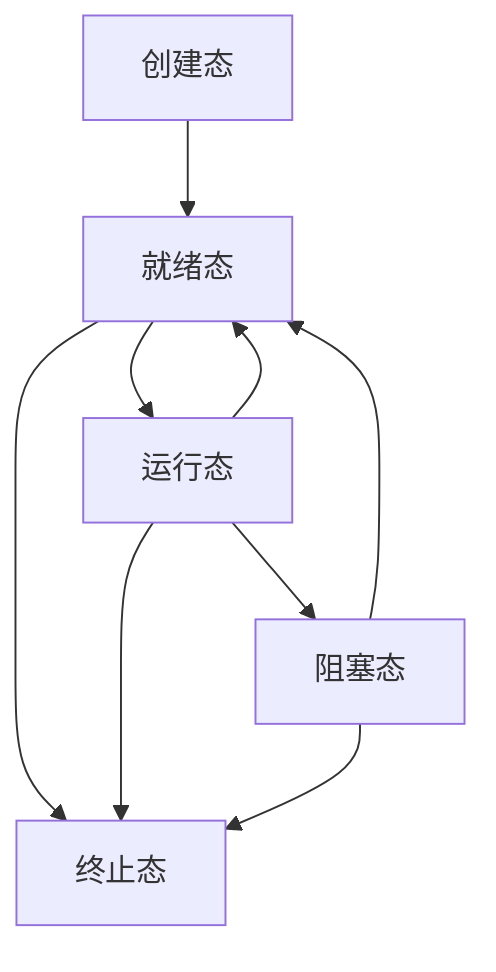
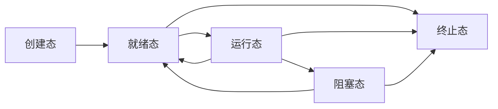

---
html:
    toc: true
print_background: true
---

# 1 markdown 文档

> 以`.md`为扩展名

# 2 markdown标题

```c
# 这是一级标题
## 这是二级标题
..... 这是 N 级标题
/*理论上标题层次可以无限嵌套*/
/*以支持markdown的编译器为准，例如vscode最多可以支持六级标题*/
```

# 3 代码块

## 3.1 不带行数的代码块

```cpp
#include <iostream>
using namespace std;

int main()
{
    cout << "Hello, world!" << endl;
    return 0;
}
```

**上述代码块如何添加呢？**
\`\`\`代码语言(`c`，`shell`，`cpp`，`python`等)
代码内容
\`\`\`

比如添加一块`cpp`代码块：

\`\`\`c
\#include <stdio.h>
\`\`\`

复制上方渲染出来的`markdown`语言，可以得到如下代码块，会自动渲染高亮：

```c
#include <stdio.h>
```

## 3.2 带行数的代码块

下方的语法格式就能得到带行数的代码块

\`\`\`c{.line-numbers}
代码内容
\`\`\`

以`2.1节`中的`cpp`代码块为例，为其添加函数可得到：

```cpp{.line-numbers}
#include <iostream>
using namespace std;

int main()
{
    cout << "Hello, world!" << endl;
    return 0;
}
```

## 3.3 某句话中引用代码

这是`markdown`的使用说明，有没有发现`markdown`被一个黑色引用框起来了？
这就是在某句话中指定代码的方法，会使得文档读起来更加舒服。

\`markdown\`，用两个 ` 将代码框起来就可以了

# 4 图表

## 4.1 流程图

### 4.1.1 类型及基本语法

1. sequenceDiagram时序图
2. classDiagram类图
3. stateDiagram:状态图
4. erDiagram：ER图
5. gantt： 甘特图
6. pie：饼图
7. requirementDiagram: 需求图

注意下面源格式的的`graph LR`：
流程图以`graph + 布局方向`开头

代码基本格式

```log
流程图/时序图代码
```

布局方向如下所示：

```log
TB，从上到下
TD，从上到下
BT，从下到上
RL，从右到左
LR，从左到右
```

- 一个进程状态图的例子，**从上到下**



- 一个进程状态图的例子，**从左到右**



### 4.1.2 符号

1. 起止框


## 4.2 表格

### 4.2.1 默认表格

如下所示，在`markdown`中输入如下源码：

```shell
|项目|内容|
# 注意，在表头的下方，必须有 |-|-|这样的形式，表示表头和内容隔开
# 当然了，|--|-|也是可以的，必须至少有一个 -
|-|-|
|项目一|内容一|
```

上面的源码经过自动渲染后会得到如下效果

|项目|内容|
|-|-|
|项目一|内容一|

**如果想要增加列数呢？**
很简单，只需要在右边增加一个`|`，`markdown`源码如下所示

```shell
|项目|内容|内容二|
|-|-|-|
|项目一|项目二|内容二|
```

上面的源码经过自动渲染后会得到如下效果

|项目|内容|内容二|
|-|-|-|
|项目一|项目二|内容二|
