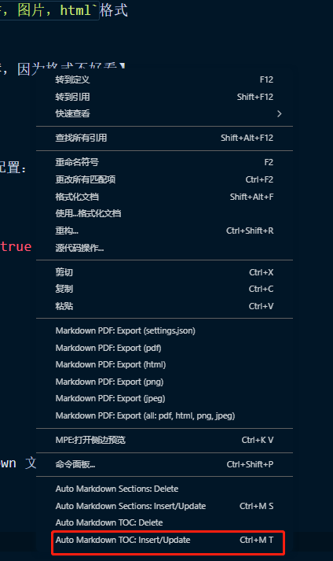
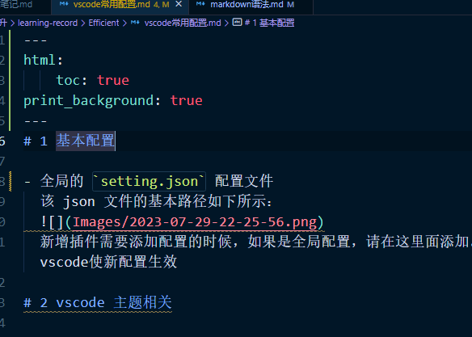
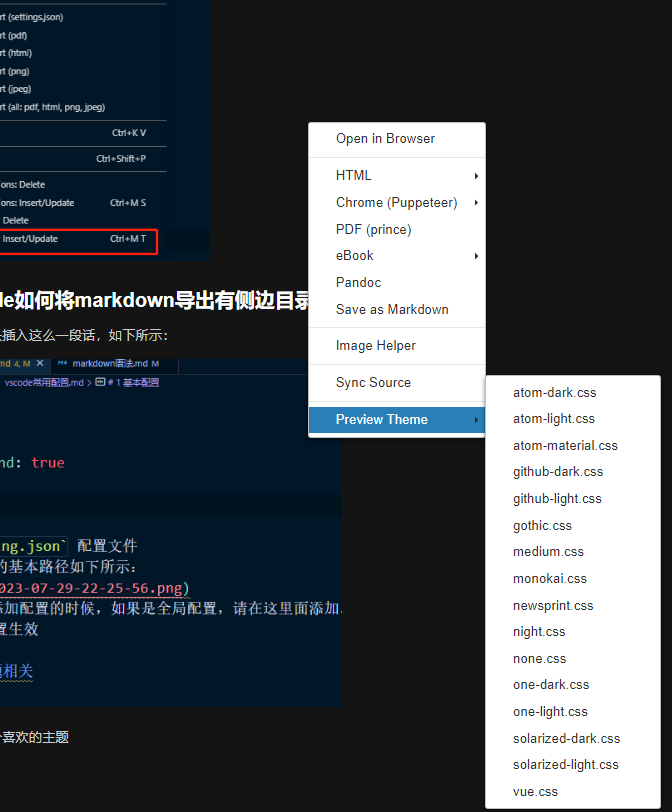
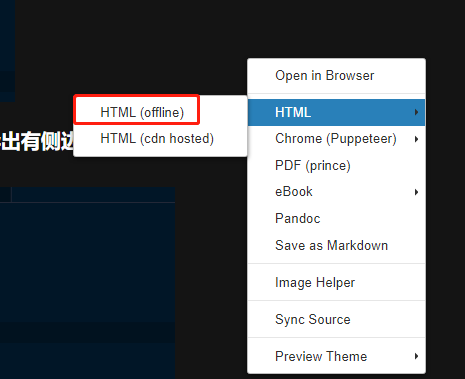

---
html:
    toc: true
print_background: true
---
# 1 基本配置

## 1.1 setting.json配置文件

- 全局的 `setting.json` 配置文件
  该 json 文件的基本路径如下所示：
  
  新增插件需要添加配置的时候，如果是全局配置，请在这里面添加。新增内容后，建议保存该文件并重启vscode使新配置生效

## 1.2 如何下载插件？

### 1.2.1 联网直接下载

如下所示，在这个地方搜索插件的名字，直接下载即可


### 1.2.2 离线下载

此方法较为复杂，后续更新

# 2 vscode 主题相关

1. Night Owl
  一个十分漂亮的暗黑系列主题

# 3 Markdown 相关配置

## 3.1 Markdown All in One

- 推荐下载，集成了包括导出`.md`文件为`PDF，图片，html`格式
- 还能提供预览等等功能
- Markdown PDF
  能够将 `.md`文件转换成PDF【但是不太推荐，因为格式不好看】

## 3.2 markdownlint

  一款自动格式化工具，推荐下载
  下载之后，在 `setting.json`下增加如下配置：

  ```json
  "editor.codeActionsOnSave": {
        "source.fixAll.markdownlint": true
    },

  "[markdown]": {
        "editor.formatOnSave": true,
        "editor.formatOnPaste": true,
    },
  ```
  
## 3.3 Markdown Preview Enhanced

  打开预览窗口，看到渲染后的 Markdown 文件格式

### 3.3.1 Auto Markdown TOC

  可以自动生成目录等，通过右键点击，可以生成目录，如下图所示：
  

### 3.3.2 使用vscode如何将markdown导出有侧边目录的HTML文件

1. 在`.md`文档的最开头插入这么一段话，如下所示：


2. 导出的时候选择一个喜欢的主题


3. 选择导出html


4. 导出后的html文件效果如下：


## 3.4 Paste Image

  在 Markdown 中插入图片的时候，需要给出图片的完整路径，才能找到并引用。
  截屏的时候，图片保存在粘贴板的缓存中，直接使用`Ctrl+v`无法复制图片到`.md`文件中，下载此插件之后，可以使用命令`Ctrl + Alt + v`将粘贴板的图片插入到 Markdown 文件中，图片保存的路径为 ./Image/
