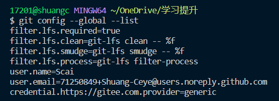
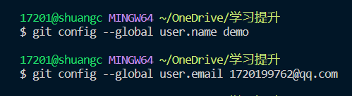
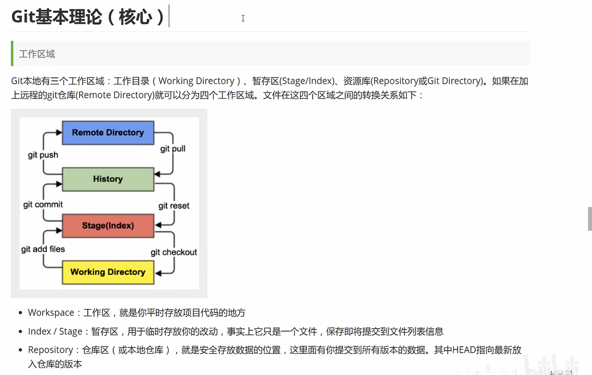
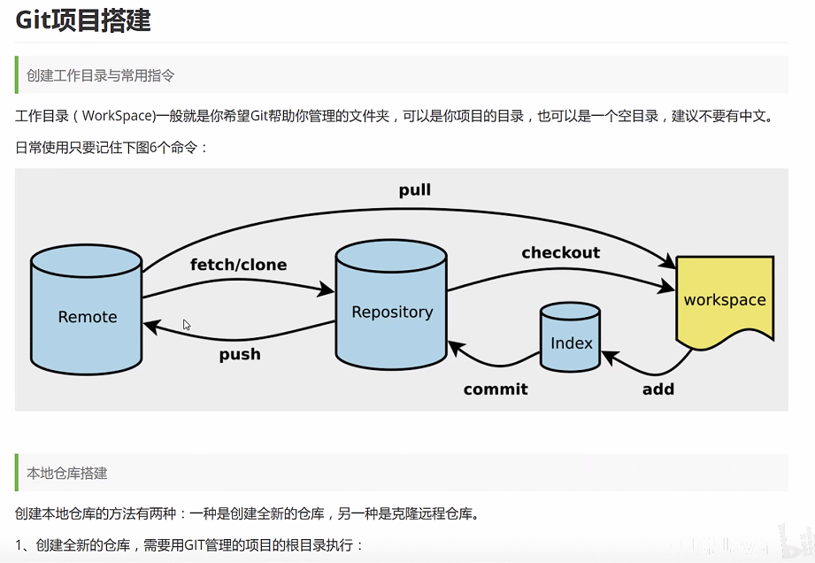
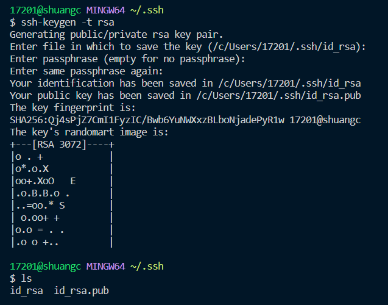

---
html:
    toc: true
print_background: true
---
# 1.版本控制的分类

## 1.1 本地版本控制

> **记录文件每次的更新，可以对每个版本做一个快照**

## 1.2 集中式版本控制

> **所有版本都存在服务器上，如果不联网的话用户就看不到历史版本，也无法切换版本验证问题**
>
> - 代表解决方案：SVN

## 1.3 分步式版本控制

> **每个人都拥有全部代码，可能会有安全隐患**
>
> - 代表解决方案：Git

<font color=red>二者最主要的区别：
Git 没有中央服务器，可以马上看到更改了哪些内容
SVN 需要从中央服务器更新后，才能看到对应的更改内容
</font>

# 2 Git 的基本命令

## 2.1 Git 配置

**所有的配置文件，实际上都保存在本地**
> **查看配置**
> -l 和 --list 等价
> git config -l
>
> - git config --system --list # 查看系统配置
> 相关的文件目录在 git安装目录下/etc/gitconfig 文件里，--system 系统级
>
> - git config --global --list # 全局配置，用户自己配置
> 例如配置了下面的用户名和邮箱
>
> 
>
> - **相关的文件在 C:\Users\Administrator\\.gitconfig 目录下，只使用户当前登录用户的配置.**
> **比如我是用户scai，那么我的全局配置文件应该在 C:\Users\sccai\.gitconfig 下面**
> **--global 表示全局**
> - **通过如下方式添加用户和邮箱**
>
> 

# 3 Git 的核心理论
>
> 
> **暂存区本质上是一些文件，逻辑上是一个暂存区，保存即将提交的文件信息**
> **Remote：最终存放数据的远程仓库**

## 3.1 Git 的基本工作流程
>
> 1. 在工作目录中添加、修改文件；【UserMapper.xml】
> 2. 将需要进行版本管理的文件放入暂存区；【git add files】
> 3. 将暂存区的文件提交到 git 仓库；【git commit】
> 4. 如果需要推送到远程代码库，则使用命令 git push
> <font color=red>因此，git 管理的文件有三种状态：已修改(modified), 已暂存(staged), 已提交(commited)</font>

## 3.2 Git 项目搭建
>
> 

### 3.2.1 创建本地仓库
>
> **搭建本地仓库或者clone远程仓库**
>
> - 搭建本地仓库
>
> ```shell
> git init
> ```
>
> - 克隆一个远程的仓库到本地
> **隆一个项目和它的整个代码历史(版本信息)**
> git clone [url]  例如：<https://github.com/Allen-Scai/Structure-and-Algorithm.git>

# 4 Git 文件操作

**版本控制就是对文件的版本控制，要对文件进行修改、提交等操作，首先要知道文件当前在什么状态，不然可能会提交了现在还不想提交的文件，或者要提交的文件没提交上。**
>
> - **Untracked: 未跟踪, 此文件在文件夹中, 但并没有加入到git库**, 不参与版本控制. **通过 `git add`状态变为Staged.**
> - **Unmodify: 文件已经入库, 未修改, 即版本库中的文件快照内容与文件夹中完全一致.** 这种类型的文件有两种去处, **如果它被修改, 而变为Modified.** 如果`使用git rm移出版本库, 则成为Untracked文件`
> - `Modified: 文件已修改, 仅仅是修改, 并没有进行其他的操作.`这个文件也有两个去处, `通过 git add 可进入暂存staged状态`, 使用`git checkout 则丢弃修改过, 返回到unmodify状态`, 这个git checkout即从库中取出文件, 覆盖当前修改 !
> - **Staged: 暂存状态.** 执行 **git commit 则将修改同步到库中, 这时库中的文件和本地文件又变为一致, 文件为Unmodify状态.** **执行`git reset HEAD filename`取消暂存, 文件状态为Modified**

## 4.1 查看文件状态

> - 查看[指定]文件状态 `git status file_name`
> - 查看所有文件状态 `git status`
> `git add file_name` 将文件加入到暂存区【添加版本控制】
> `git commit -m "消息内容"`提交暂存区中的内容到本地仓库，m 是 message 的意思

## 4.2 忽略文件

**有些时候我们不想把某些文件纳入版本控制中，比如数据库文件，临时文件，设计文件等在主目录下建立".gitignore"文件，此文件有如下规则：**

> - 忽略文件中的空行或以井号（#）开始的行将会被忽略。
> - 可以使用Linux通配符。例如：星号（*）代表任意多个字符，问号（？）代表一个字符，方括号（[abc]）代表可选字符范围，大括号（{string1,string2,...}）代表可选的字符串等。
> - 如果名称的最前面有一个感叹号（!），表示例外规则，将不被忽略。
> - 如果名称的最前面是一个路径分隔符（/），表示要忽略的文件在此目录下，而子目录中的文件不忽略。
> - 如果名称的最后面是一个路径分隔符（/），表示要忽略的是此目录下该名称的子目录，而非文件（默认文件或目录都忽略）。
>
```bash

#为注释
*.txt        #忽略所有 .txt结尾的文件,这样的话上传就不会被选中！
!lib.txt     #但lib.txt除外
/temp        #仅忽略项目根目录下的TODO文件,不包括其它目录temp
build/       #忽略build/目录下的所有文件
doc/*.txt    #会忽略 doc/notes.txt 但不包括 doc/server/arch.txt
```

# 5 使用 Github

## 5.1 添加 ssh 公钥
>
> **cd ~/.ssh/  进入到用户目录下的 .ssh/ 文件夹下执行下面的命令**
> `ssh-keygen -t rsa`
> 生成了两个文件，带 .pub 的是公钥，不带的是私钥
>
> 

# 5 Git 分支

**后续补充**

# 6 git 使用中的相关问题

# 6.1 .gitconfig 文件被误删除或者找不到了应该怎么办?

如果你误删了`git`的配置文件`.gitconfig`，可以通过以下步骤恢复：

1. 打开终端或命令行窗口，进入你的`home`目录。不同的操作系统下，`home`目录的路径略有不同，比如在Linux和Mac OS下，`home`目录对应的路径为`/home/<username>`和`/Users/<username>`，在Windows下，`home`目录对应的路径为`C:\Users\<username>`。

2. 检查是否存在`.gitconfig.backup`文件，该文件是`.gitconfig`文件的备份文件。如果存在该文件，可以将它重命名为`.gitconfig`，并将其复制到`home`目录下即可。

3. 如果没有`.gitconfig.backup`文件，可以通过以下命令重新生成一个默认的`.gitconfig`文件：

   ```bash
   git config --global --unset-all user.name
   git config --global --unset-all user.email
   rm -f ~/.gitconfig
   git config --global user.name "Your Name"
   git config --global user.email "your-email@example.com"
   ```

   以上命令会先将所有的`user.name`和`user.email`配置项清空，然后删除当前用户的`.gitconfig`文件，最后重新设置`user.name`和`user.email`配置项，从而生成一个新的`.gitconfig`文件。注意，上述命令中的`Your Name`和`your-email@example.com`需要替换为你自己的用户名和邮箱地址。
