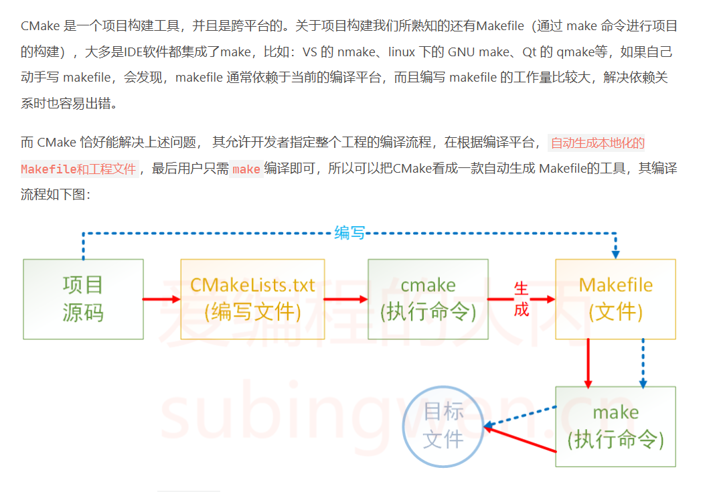
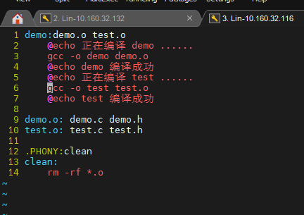
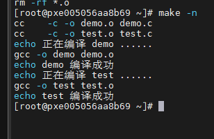
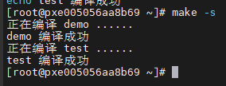
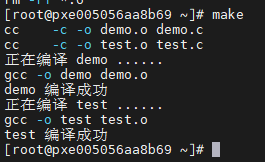

# makefile 学习笔记

# 1 概述

## 1.1 Makefile 与 [cmake](https://www.subingwen.cn/cmake/CMake-primer/) 的区别



简单点说就是，cmake 生成 makefile 文件

## 1.2 程序的编译与链接

1. 编译
   - 无论是 C、C++、还是 pas，首先要把源文件编译成中间代码文件，在 Windows 下也就是 .`obj 文件`，UNIX 下是 `.o 文件`，即 Object File，这个动作叫做编译（compile）。

    - 编译时，编译器需要的是语法的正确，函数与变量的声明的正确
2. 链接
   - 把大量的 Object File 合成执行文件。
   - 链接通常是你需要告诉编译器头文件的所在位置（头文件中应该只是声明，而定义应该放在 C/C++文件中），只要所有的语法正确，编译器就可以编译出中间目标文件。

3. 库文件
   在大多数时候，由于源文件太多，编译生成的中间目标文件太多，而在链接时需要明显地指出中间目标文件名，这对于编译很不方便，所以，我们要给中间目标文件打个包，在 Windows 下这种包叫“库文件”（Library File)，也就是 .lib 文件，在 UNIX下，是 Archive File，也就是 .a 文件。

上述三个步骤总结如下：

总结一下，源文件首先会生成中间目标文件，再由中间目标文件生成执行文件。在编译时，编译器只检测程序语法，和函数、变量是否被声明。如果函数未被声明，编译器会给出一个警告，但可以生成 Object File。而在链接程序时，链接器会在所有的 Object File 中找寻函数的实现，如果找不到，那到就会报链接错误码（Linker Error），在 VC 下，这种错误一般是：Link 2001 错误，意思说是说，链接器未能找到函数的实现。你需要指定函数的Object File.

## 1.3 Makefile 的基本规则

一个 Makefile 文件由一系列规则组成，每个规则定义了一个或多个目标文件的构建过程。每个规则由以下几个部分组成：

1. 目标（Target）：目标是规则的输出文件，也是规则的名称。它通常是一个可执行文件、库文件或中间文件。目标文件可以是 Makefile 中的一个或多个文件。

2. 依赖（Dependencies）：依赖是用于构建目标文件的输入文件或其他目标文件。依赖可以是源代码文件、头文件、库文件或其他规则定义的目标文件。如果依赖文件的修改时间较新，或者目标文件不存在，就会触发重新构建目标文件的动作。

3. 命令（Commands）：命令是构建目标文件的步骤。它们是 Makefile 中的一行或多行命令，用于编译、链接、复制文件等操作。**命令必须以一个 Tab 键开头，表示在 Makefile 中的命令行(shell命令)**。

下面是一个示例 Makefile 规则的基本结构：

```makefile
target: dependencies
    command1
    command2
    ...
```

其中，`target` 是目标文件的名称，`dependencies` 是构建目标文件所需的依赖文件。`command1`、`command2` 等是构建目标文件的命令。

Makefile 中可以有多个规则，每个规则独占一行。Make 工具会按照规则的顺序执行，构建目标文件和满足依赖关系。

例如，下面是一个简单的 Makefile，用于构建一个名为 `hello` 的可执行文件：

```makefile
hello: main.o utils.o
    gcc main.o utils.o -o hello

main.o: main.c utils.h
    gcc -c main.c

utils.o: utils.c utils.h
    gcc -c utils.c
```

在这个示例中，规则 `hello` 定义了目标文件 `hello` 的构建过程，它依赖于 `main.o` 和 `utils.o`。如果 `main.o` 或 `utils.o` 的修改时间较新，或者 `hello` 文件不存在，Make 工具将执行对应的命令来构建目标文件 `hello`。

规则 `main.o` 和 `utils.o` 分别定义了 `main.o` 和 `utils.o` 的构建过程，它们分别依赖于对应的源代码文件和头文件。如果源代码文件或头文件的修改时间较新，或者目标文件不存在，Make 工具将执行对应的命令来构建目标文件 `main.o` 或 `utils.o`。

这只是 Makefile 中规则的基本概念和结构。Makefile 还支持变量、条件语句、循环等高级特性，以提供更复杂的构建过程。你可以根据具体的需求使用适当的规则和功能来编写 Makefile 文件。

## 1.4 Makefile 中使用变量

在 Makefile 中，可以使用变量来存储和引用值。变量可以包含文件名、编译器选项、目录路径等常用的值。使用变量可以使 Makefile 更加灵活和可维护，方便在需要时进行修改。

变量定义及其使用方法：

```makefile
#定义改一个变量
object = main.o test.o

edit: $(object)
    gcc -o edit $(object)

%.o: %.c
    gcc -c $< -o $@
```

下面是一个示例，演示了如何在 Makefile 中使用变量：

```makefile
CC = gcc
CFLAGS = -Wall -Werror
SRC = main.c utils.c
OBJ = $(SRC:.c=.o)
TARGET = hello

$(TARGET): $(OBJ)
    $(CC) $(OBJ) -o $(TARGET)

%.o: %.c
    $(CC) $(CFLAGS) -c $< -o $@

clean:
    rm -f $(OBJ) $(TARGET)
```

在这个示例中，我们定义了几个变量：

- `CC` 存储了编译器的名称，这里是 `gcc`。
- `CFLAGS` 存储了编译器的选项，这里是 `-Wall -Werror`，表示开启所有警告并将警告视为错误。
- `SRC` 存储了源代码文件的名称，这里是 `main.c utils.c`。
- `OBJ` 使用了变量替换功能，将 `SRC` 中的 `.c` 扩展名替换为 `.o` 扩展名。
- `TARGET` 存储了目标文件的名称，这里是 `hello`。

在规则中，我们使用这些变量来构建目标文件和执行命令。例如，在规则 `$(TARGET): $(OBJ)` 中，我们使用 `$(CC)` 和 `$(OBJ)` 分别引用了编译器和目标文件的变量值。同样，在规则 `%.o: %.c` 中，我们使用了 `$<` 和 `$@`，它们分别表示当前依赖文件和目标文件的变量值。

最后，我们还定义了一个 `clean` 规则，用于清理生成的目标文件和可执行文件。在这个规则中，我们使用了 `$(OBJ)` 和 `$(TARGET)` 来引用变量值，以便删除相应的文件。

通过使用变量，我们可以方便地修改编译器、选项、源文件以及目标文件的名称，而不必在整个 Makefile 中逐个修改。这提高了 Makefile 的可维护性和灵活性。

**对上述的 %.o: %.c的说明**
在 Makefile 中，规则 `%.o: %.c` 表示将所有以 `.o` 结尾的目标文件依赖于同名但以 `.c` 结尾的源文件。这个规则可以用来编译每个源文件并生成对应的目标文件。

在这个规则中，`$<` 和 `$@` 是自动化变量，它们分别表示当前规则中的依赖文件和目标文件的变量值。

- `$<` 表示依赖文件，即源文件的变量值。在这个示例中，`%.c` 表达式匹配到的源文件会被赋值给 `$<`，然后在命令中使用。
- `$@` 表示目标文件的变量值，即规则的目标文件。在这个示例中，`%.o` 表达式匹配到的目标文件会被赋值给 `$@`，然后在命令中使用。

这样，当 Make 工具执行这个规则时，它会将 `$<` 替换成当前匹配到的源文件的名称，将 `$@` 替换成当前匹配到的目标文件的名称。这样，我们可以通过引用这些自动化变量来构建编译命令，以确保每个源文件都会被正确编译为对应的目标文件。

## 1.5 makefile 自动推导

只要 make 看到一个[.o]文件，它就会自动的把[.c]文件加在依赖关系中，如果 make 找到一个 whatever.o，那么 whatever.c，就会是 whatever.o 的依赖文件。并且 `cc -c whatever.c` 也会被推导出来

例如下面的例子：

```makefile
objects = main.o kbd.o command.o display.o \ 
          insert.o search.o files.o utils.o 
 
edit : $(objects) 
    cc -o edit $(objects) 
 
main.o : defs.h 
kbd.o : defs.h command.h 
command.o : defs.h command.h 
display.o : defs.h buffer.h 
insert.o : defs.h buffer.h 
search.o : defs.h buffer.h 
files.o : defs.h buffer.h command.h 
utils.o : defs.h 
 
.PHONY : clean 
clean : 
    rm edit $(objects) 
```

在大部分情况下，`gcc` 和 `cc` 是可以互换使用的，它们代表同一个编译器.`gcc` 是 GNU Compiler Collection（GNU 编译器集合）的缩写，而 `cc` 是 C Compiler（C 编译器）的缩写。

在大多数的 Unix-like 系统中，`cc` 是一个符号链接（symbolic link），指向系统默认的 C 编译器，通常是 `gcc`。这样做是为了方便用户使用 `cc` 命令来编译 C 代码，而无需关心具体使用的是哪个编译器。

因此，当你在 Makefile 中使用 `gcc` 或 `cc` 来编译 C 代码时，效果是相同的，它们都会调用系统默认的 C 编译器进行编译。具体系统中的默认编译器可能会有所不同，可以通过在命令行中执行 `cc --version` 或 `gcc --version` 来查看默认的 C 编译器版本信息。

`.PHONY`表示，clean 是个伪目标文件。

## 1.6 清空目标文件的规则

每个 Makefile 中都应该写一个清空目标文件（.o 和执行文件）的规则，这不仅便于重编译，也很利于保持文件的清洁。

一般的风格都是：

```makefile
clean:
    rm edit $(objects)

更为稳健的做法是：

.PHONY : clean
clean :
    -rm edit $(objects)
```

前面说过，`.PHONY 意思表示 clean 是一个“伪目标”`，。而在 `rm 命令前面加了一个小减号的意思就是，也许某些文件出现问题，但不要管，继续做后面的事`。当然，clean 的规则不要放在文件的开头，不然，这就会变成 make 的默认目标，相信谁也不愿意这样。不成文的规矩是——“clean 从来都是放在文件的最后”。

## 1.7 注释

Makefile 中只有行注释，和 UNIX 的 Shell 脚本一样，其注释是用“#”字符，这个就像 C/C++中的“//”一样。如果你要在你的 Makefile 中使用“#”字符，可以用反斜框进行转义，如：`\#`。

还值得一提的是，在 `Makefile 中的命令，必须要以[Tab]键开始`.

## 1.8 Makefile 文件名

默认的情况下，make 命令会在当前目录下按顺序找寻文件名为“GNUmakefile”、“makefile”、“Makefile”的文件，找到了解释这个文件。**在这三个文件名中，最好使用“Makefile”这个文件名，因为，这个文件名第一个字符为大写，这样有一种显目的感觉。**

最好不要用“GNUmakefile”，这个文件是 GNU 的 make 识别的。有另外一些 make 只对全小写的“makefile”文件名敏感，但是基本上来说，大多数的 make 都支持“makefile”和“Makefile”这两种默认文件名。

也可以使用别的文件名来书写Makefile ， 比 如 ： “Make.Linux” ，
“Make.Solaris”，“Make.AIX”等，如果要指定特定的 Makefile，你可以使用 make 的 `“-f”和“--file” 参数`，如：make -f Make.Linux 或 make --file Make.AIX。

## 1.9 引用其他的 Makefile

在 Makefile 使用 include 关键字可以把别的 Makefile 包含进来，这很像 C 语言的 # include，**被包含的文件会原模原样的放在当前文件的包含位置**。

include 的语法是include <filename>filename 可以是当前操作系统 Shell 的文件模式（可以保含路径和通配符） **在 include前面可以有一些空字符，但是绝不能是[Tab]键开始**。include 和<filename>可以用一个或多个空格隔开。举个例子，你有这样几个 Makefile：a.mk、b.mk、c.mk，还有一个文件叫 foo.make，以及一个变量$(bar)，其包含了 e.mk 和 f.mk，那么，下面的语句：

```makefile
include foo.make *.mk $(bar)
# 等价于:
include foo.make a.mk b.mk c.mk e.mk f.mk
```

make 命令开始时，会把找寻 include 所指出的其它 Makefile，并把其内容安置在当前的位置上。就好像 C/C++的#include 指令一样。如果文件都没有指定绝对路径或是相对路径的话，make 会在当前目录下首先寻找，如果当前目录下没有找到，那么，make 还会在下面的几个目录下找：

1、如果 make 执行时，有`-I`或`--include-dir`参数，那么 make 就会在这个参数所指定的目录下去寻找。
2、如果目录<prefix>/include（一般是：/usr/local/bin 或/usr/include）存在的话，make 也会去找。如果有文件没有找到的话，make 会生成一条警告信息，但不会马上出现致命错误。它会继续载入其它的文件，一旦完成 makefile 的读取，make 会再重试这些没有找到，或是不能读取的文件，如果还是不行，make 才会出现一条致命信息。**如果你想让 make不理那些无法读取的文件，而继续执行，你可以在 include 前加一个减号`-`**。

# 2 书写规则详述

## 2.1 在规则中使用通配符

### 2.1.1 可使用的通配符

Makefile 支持以下通配符：

1. `*`：匹配任意字符（除了斜杠 `/`）的任意长度，可以用于文件名、路径名等。

   例如，`*.c` 匹配当前目录下的所有以 `.c` 结尾的文件。

2. `?`：匹配任意单个字符，可以用于文件名、路径名等。

   例如，`?abc.c` 匹配当前目录下以任意字符开头，后跟 `abc.c` 的文件名。

3. `[]`：匹配括号内的任意一个字符，可以用于文件名、路径名等。

   例如，`[aeiou].c` 匹配当前目录下以元音字母开头，后跟 `.c` 结尾的文件名。

4. `{}`：匹配括号内的任意一个模式，可以用于文件名、路径名等。

   例如，`{src,include}/*.c` 匹配当前目录下的 `src/` 和 `include/` 目录中的所有 `.c` 文件。

5. `**`：匹配任意级别的目录，可以用于路径名。

   例如，`src/**/*.c` 匹配 `src/` 及其子目录中的所有 `.c` 文件。

这些通配符可以在 Makefile 的规则中使用，用于指定目标文件、依赖文件等。例如，可以使用通配符来编译所有的源文件，而不需要逐个指定每个文件的名称。

需要注意的是，通配符在 Makefile 中的使用可能会因不同的工具链和操作系统而有所差异，因此在编写 Makefile 时应注意与所用工具链的兼容性。

## 2.2 文件搜寻

在一些大的工程中，有大量的源文件，我们通常的做法是把这许多的源文件分类，并存放在不同的目录中。所以，当 make 需要去找寻文件的依赖关系时，你可以在文件前加上路径，但最好的方法是把一个路径告诉 make，让 make 在自动去找。

Makefile 文件中的特殊变量`VPATH`就是完成这个功能的，如果没有指明这个变量，make 只会在当前的目录中去找寻依赖文件和目标文件。如果定义了这个变量，那么，make就会在当当前目录找不到的情况下，到所指定的目录中去找寻文件了。

- 特殊变量 `VPATH` (大写)的用法
    `VPATH = src:../headers`

    上面的的定义指定两个目录，“src”和“../headers”，make 会按照这个顺序进行搜索。目录由“冒号”分隔。（**当前目录永远是最高优先搜索的地方**）

- 关键字 vpath (小写)的用法
该关键字使用方法有三种

```makefile
# 为符合模式<pattern>的文件指定搜索目录<directories>
1、vpath <pattern> <directories>  

# 清除符合模式<pattern>的文件的搜索目录
2、vpath <pattern> 

# 清除所有已被设置好了的文件搜索目录 
3、vpath 
```

vapth 使用方法中的<pattern>需要包含“%”字符。“%”的意思是匹配零或若干字符，例如，“%.h”表示所有以“.h”结尾的文件。<pattern>指定了要搜索的文件集，而<directories>则指定了<pattern>的文件集的搜索的目录。例如：

`vpath %.h ../headers`

该语句表示，要求 `make 在“../headers”目录下搜索所有以“.h”结尾的文件`。（如果某文件在当前目录没有找到的话）

我们可以连续地使用 vpath 语句，以指定不同搜索策略。如果连续的 vpath 语句中出现了相同的<pattern>，或是被重复了的<pattern>，那么，make 会按照 vpath 语句的先后顺序来执行搜索。如：

```makefile
vpath %.c foo
vpath % blish
vpath %.c bar
```

其表示“.c”结尾的文件，先在“foo”目录，然后是“blish”，最后是“bar”目录。

```makefile
vpath %.c foo:bar
vpath % blish
```

而上面的语句则表示“.c”结尾的文件，先在“foo”目录，然后是“bar”目录，最后
才是“blish”目录。

## 2.3 伪目标 .PHONY

**“伪目标”并不是一个文件，只是一个标签(类似于 C 语言中的 goto 语句标签)**，由于“伪目标”不是文件，所以 make 无法生成它的依赖关系和决定它是否要执行。我们只有通过显示地指明这个“目标”才能让其生效。当然，“伪目标”的取名不能和文件名重名，不然其就失去了“伪目标”的意义了。

**可以使用一个特殊的标记“.PHONY”来显示地指明一个目标是“伪目标”**

其一般形式如下：

```makefile
PHONY: clean 
clean: 
    rm *.o temp
```

- 伪目标也可以指定依赖文件
如下所示：

声明了一个伪目标，伪目标名称为  `all`，当输入一个 `make`的时候，就可以生成3个目标文件

```makefile
all : prog1 prog2 prog3 
.PHONY : all 
 
prog1 : prog1.o utils.o 
    gcc -o prog1 prog1.o utils.o 
 
prog2 : prog2.o 
    gcc -o prog2 prog2.o 
 
prog3 : prog3.o sort.o utils.o 
    gcc -o prog3 prog3.o sort.o utils.o
```

**可以使用伪目标来清除不同类型的文件(用标签定义的方式，指定不同的操作)：**

```makefile
.PHONY: cleanall cleanobj cleandiff 

cleanall : cleanobj cleandiff 
    rm program 

cleanobj : 
    rm *.o 
 
cleandiff : 
    rm *.diff 
```

“cleanobj”和“cleandiff”这两个伪目标有点像“子程序”的意思。我们可以输入`make cleanall`和`make cleanobj`和`make cleandiff`命令来达到清除不同种类文件的目的。

## 2.4 静态模式

```makefile
<targets ...>: <target-pattern>: <prereq-patterns ...>
    <commands>
....
```

targets 定义了一系列的目标文件，可以有通配符。是目标的一个集合。
target-parrtern 是指明了 targets 的模式，也就是的目标集模式。
prereq-parrterns 是目标的依赖模式，它对 target-parrtern 形成的模式再进行一次依赖目标的定义。

我们的“目标模式”或是“依赖模式”中都应该有“%”这个字符，如果你的文件名中有“%”那么你可以使用反斜杠“\”进行转义，来标明真实的“%”字符。
看一个例子：

```makefile
objects = foo.o bar.o

all: $(objects)

$(objects): %.o: %.c
$(CC) -c $(CFLAGS) $< -o $@
```

上面的例子中，指明了我们的目标从`$object` 中获取，“%.o”表明要所有以“.o”结尾的目标，也就是“foo.o bar.o”，也就是变量`$object` 集合的模式，而依赖模式“%.c”则取模式“%.o”的“%”，也就是“foo bar”，并为其加下“.c”的后缀，于是，我们的依赖目标就是“foo.c bar.c”。而命令中的“$<”和“$@”则是自动化变量，“$<”表示所有的依赖目标集（也就是“foo.c bar.c”），“$@”表示目标集（也就是“foo.o bar.o”）。

于是，上面的规则展开后等价于下面的规则：

```makefile
foo.o : foo.c
    $(CC) -c $(CFLAGS) foo.c -o foo.o
bar.o : bar.c
    $(CC) -c $(CFLAGS) bar.c -o bar.o
```

## 2.5 自动生成依赖性

在 Makefile 中，我们的依赖关系可能会需要包含一系列的头文件，比如，如果我们的 main.c中有一句`#include "defs.h"`，那么我们的依赖关系应该是：

`main.o : main.c defs.h`

大多数的C/C++编译器都支持一个“-M”的选项，即自动找寻源文件中包含的头文件，并生成一个依赖关系。例如，如果我们执行下面的命令：
`cc -M main.c`

其输出是：
`main.o : main.c defs.h`

**如果使用 GNU 的 C/C++编译器**，你得用`-MM参数`，不然，`-M参数`会把一些标准库的头文件也包含进来。

`gcc -M main.c` 的输出是：

```makefile
main.o: main.c defs.h /usr/include/stdio.h /usr/include/features.h \
/usr/include/sys/cdefs.h /usr/include/gnu/stubs.h \
/usr/lib/gcc-lib/i486-suse-linux/2.95.3/include/stddef.h \
/usr/include/bits/types.h /usr/include/bits/pthreadtypes.h \
/usr/include/bits/sched.h /usr/include/libio.h \
/usr/include/_G_config.h /usr/include/wchar.h \
/usr/include/bits/wchar.h /usr/include/gconv.h \
/usr/lib/gcc-lib/i486-suse-linux/2.95.3/include/stdarg.h \
/usr/include/bits/stdio_lim.h
```

**gcc -MM main.c 的输出是：**

```makefile
main.o: main.c defs.h
```

# 3 书写命令

## 3.1 显示命令

看下列例子：

假设我们有一个Makefile，其中有一个编译指令如下：

```makefile
@echo 正在编译 XXX 模块......
```

当我们运行`make`命令时，如果没有使用`@`字符，`make`将输出以下内容：

```makefile
echo 正在编译 XXX 模块......
正在编译 XXX 模块......
```

其中第一行是`make`将要执行的命令，第二行是命令的实际输出。

而如果在`echo`命令前加上`@`字符，即`@echo 正在编译 XXX 模块......`，那么当我们运行`make`命令时，`make`只会输出以下内容：

```
正在编译 XXX 模块......
```

这样，命令本身将不会被显示，只会显示命令的输出。

另外，如果我们使用`make`命令时带入`-n`或`--just-print`参数，`make`只会显示命令，但不会执行命令。这对于调试`Makefile`非常有用，可以查看我们编写的命令在执行时是什么样子或是什么顺序。

另一方面，如果我们使用`make`命令时带入`-s`或`--silent`参数，`make`会完全禁止命令的显示，即使在命令行中使用了`@`字符也不会显示命令输出。

这些功能可以帮助我们在使用`make`构建时，根据需要控制命令的显示与否，以便更好地调试和了解构建过程。

如下本地写好一个 Makefile：

```makefile
demo:demo.o test.o
    @echo 正在编译 demo ......
    gcc -o demo demo.o
    @echo demo 编译成功
    @echo 正在编译 test ......
    gcc -o test test.o
    @echo test 编译成功

demo.o: demo.c demo.h
test.o: test.c test.h

.PHONY:clean
clean:
    rm -rf *.o
```


`-n 命令输出以下内容`

`-s 命令输出以下内容：`

`不带参数则输出以下内容：`


## 3.2 命令执行

当依赖目标新于目标时，也就是当规则的目标需要被更新时，make 会一条一条的执行其后的命令。需要注意的是，**如果你要让上一条命令的结果应用在下一条命令时，你应该使用分号分隔这两条命令**。比如你的第一条命令是 cd 命令，你希望第二条命令得在 cd 之后的基础上运行，那么你就不能把这两条命令写在两行上，而应该把这两条命令写在一行上，用分号分隔。如：

```makefile
# 示例一：
exec:
    cd /home/hchen
    # 没有和上面的 cd 命令写在同一行且用 ; 隔开，无效
    pwd
# 示例二：
exec:
    cd /home/hchen; pwd
```

**当我们执行“make exec”时，第一个例子中的 cd 没有作用，pwd 会打印出当前的Makefile 目录**，而**第二个例子中，cd 就起作用了，pwd 会打印出“/home/hchen”**。make一般是使用环境变量 SHELL 中所定义的系统 Shell 来执行命令，默认情况下使用 UNIX 的标准 Shell——/bin/sh 来执行命令。但在 MS-DOS 下有点特殊，因为 MS-DOS 下没有 SHELL环境变量，当然你也可以指定。如果你指定了 UNIX 风格的目录形式，首先，make 会在 SHELL所指定的路径中找寻命令解释器，如果找不到，其会在当前盘符中的当前目录中寻找，如果再找不到，其会在 PATH 环境变量中所定义的所有路径中寻找。MS-DOS 中，如果你定义的命令解释器没有找到，其会给你的命令解释器加上诸如“.exe”、“.com”、“.bat”、“.sh”等后缀。

## 3.3 命令出错的处理方式

**如果一个规则的某个命令出错了(命令退出码非零)，make就会终止执行当前规则，这就有可能终止所有规则的执行**

- 在命令前面加上一个`-`号，不管命令是否出错，都认为当前命令是执行成功的
- `make`执行的时候，加上`-i`或`--ignore--errors`选项，Makefile中的所有命令都会忽略错误
- `-k`或`--keep-going`命令，如果某规则中的命令出错了，就终止该目标的执行，但是继续执行其他的规则

## 3.4 定义命令包

命令包（recipe）是在Makefile中定义一系列命令的方法。它可以用于定义一组相关的命令，使Makefile更加模块化和可读性更强。

在Makefile中，你可以使用以下语法来定义一个命令包：

```makefile
define <命令包名称>
    <命令1>
    <命令2>
    ...
endef
```

其中，`<命令包名称>` 是你为命令包指定的名称，可以自定义。`<命令1>`、`<命令2>`等是命令包中的命令序列。

以下是一个示例，展示了命令包的用法：

 ```makefile
 define compile
     gcc -o $@ $<
 endef
 
 all: target
 
 target: file1.o file2.o
     $(compile)
 
 file1.o: file1.c
     $(compile)
 
 file2.o: file2.c
     $(compile)
 ```

在这个示例中，我们定义了一个命令包 `compile`，其中包含了编译目标文件的命令序列。然后，在目标 `target` 和规则 `file1.o`、`file2.o` 中，我们使用了命令包 `$(compile)` 来执行编译命令。

使用命令包的好处包括：

1. 代码重用：当多个目标需要执行相同的命令序列时，可以定义一个命令包，并在不同的目标中重复使用。
2. 可读性和维护性：通过将一系列命令放在命令包中，可以使Makefile更加清晰和易于维护。
3. 灵活性：你可以根据需要定义多个命令包，并根据不同的目标使用不同的命令包。

总结起来，命令包是在Makefile中定义一系列命令的方法。通过定义命令包，可以实现代码重用、提高可读性和维护性，并增加Makefile的灵活性。

## 3.4 变量

变量在声明时需要给予初值，而在使用时，**需要给在变量名前加上“$”符号，但最好用小括号“（）”或是大括号“{}”把变量给包括起来**。如果你要使用真实的“$”字符，那么你需要用“$$”来表示。

变量可以使用在许多地方，如规则中的“目标”、“依赖”、“命令”以及新的变量中。先看一个例子：

```makefile
objects = program.o foo.o utils.o
program : $(objects)
    gcc -o program $(objects)

$(objects) : defs.h
```

**makefile中的变量，类似于 C 语言的 #define，会把变量里面的内容，原样在使用的地方展开**

- 使用定义好的变量定义新的变量

  ```makefile
  foo = $(bar)
  bar = $(ugh)
  ugh = Huh?

    all:
    echo $(foo)
  ```

  上例中，我们执行“make all”将会打出变量$(foo)的值是“Huh?”（ $(foo)的值是$(bar)，$(bar)的值是$(ugh)，$(ugh)的值是“Huh?”）可见，变**量是可以使用后面的变量来定义的。**

- 使用`:=`定义变量

    ```makefile
    x := foo
    y := $(x) bar
    x := later
    ```

    其等价于：

    ```makefile
    y := foo bar
    x := later
    ```

    **这种方法，前面的变量不能使用后面的变量，只能使用前面已定义好了的变量。**
- 使用`?=`
    `FOO ?= bar`表示如果 FOO 没有被定义过，那么变量 FOO 的值就是“bar”，如果 FOO 先前被定义
    过，那么这条语将什么也不做，其等价于：

    ```makefile
    ifeq ($(origin FOO), undefined)
    FOO = bar
    endif
    ```

## 3.5 变量的高级用法

### 3.5.1 变量替换

1. 用法1

    ```makefile
    foo := a.o b.o c.o 
    bar := $(foo:.o=.c)
    ```

    上面的例子，`$(foo:.o=.c)`表示把`foo`中所有以`.o`**结尾**的文件，换成以`.c`**结尾**的文件。
2. 用法2

    ```makefile
    foo := a.o b.o c.o
    bar := $(foo:%.o=%.c)
    ```

    上例中的`%`是一个通配符，匹配任意内容，将`foo`中以`.o`结尾的文件替换成`.c`结尾的文件，并赋值给变量`bar`

### 3.5.2 追加变量值

- 使用`+=`追加变量值

  ```makefile
  objects = main.o foo.o bar.o utils.o
  objects += another.o
  ```
