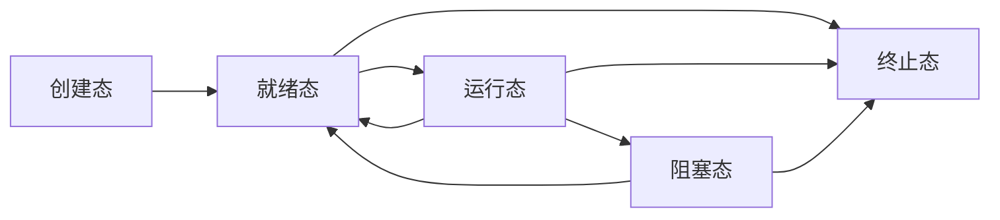

---
html:
    toc: true
print_background: true
---

# 1 进程环境

## 1.1 main 函数

### 1.1.1 main 函数的参数

`int main(int argc, char *argv[])`是`main`函数的原型,
其中`argc`是参数的总数量，`argv`是指向各个参数的指针数组

例如下面的一段代码

```c{.line-numbers}
#include <stdio.h>

int main(int argc, char *argv[])
{
    int i = 0;
    for(i = 0; i < argc; i++) {
        printf("argv[%d]: %s\n", i, argv[i]);
    }   
    return 0;
}
```

编译后运行可以像下面这样传递参数并获得打印结果：

```shell
[root@pxe005056aa8b69 ~]# ./demo arg1 arg2 arg3
argv[0]: ./demo
argv[1]: arg1
argv[2]: arg2
argv[3]: arg3
```

### 1.1.2 main 函数那些鲜少被人熟知的特点

**当内核执行C程序时(使用一个 `exec` 函数)，在调用 `main`前先调用一个特殊的<font color=red>启动例程</font>**

## 1.3 环境表


## 1.4 C程序的存储布局空间


<br>


**使用`size`命令报告正文段、数据段和 bss段 的长度：**

```shell
# dec 和 hex 分别是以10进制和16进制显示的3段总长度值
[root@pxe005056aa8b69 process]# size /usr/bin/cc /bin/sh
   text    data     bss     dec     hex filename
 754901    8504   81856  845261   ce5cd /usr/bin/cc
 905942   36000   22920  964862   eb8fe /bin/sh
```

# 2 进程控制

## 2.1 进程状态

1. 创建态
2. 就绪态
3. 执行态
4. 阻塞态
5. 终止态



## 2.2 进程标识

- 进程ID是可复用的。当一个进程终止后，其进程ID就成为复用的候选者。大多数UNIX系统实现延迟复用算法，使得赋予新建进程的ID不同于最近终止进程所使用的ID。**这防止了将新进程误认为是使用同一ID的某个已终止的先前进程**
- **ID为0的进程通常是调度进程**，常常被称为`交换进程(swapper)`。该进程是内核的一部分，它并不执行任何磁盘上的程序，因此也被称为`系统进程`。
- **进程ID为1通常是init进程**，在自举过程结束时由内核调用。**init进程绝不会终止，它是一个普通的用户进程(与交换进程不同，它不是内核中的系统进程)，但是它以超级用户特权执行。
- **在某些UNIX系统的虚拟存储器实现中，进程ID 2是页守护进程(page daemon)，此进程负责支持虚拟存储器系统的分页操作。**

Linux中进程ID为 pid_t 类型，其本质是一个正整数，通过上边的ps aux命令已经得到了验证。PID为1的进程是Linux系统中创建的第一个进程。

## 2.3 进程创建

### 2.3.1 fork函数

```c
#include <unistd.h>

pid_t fork(void);
/*
fork() 调用成功之后，会返回两个值，父子进程的返回值是不同的。

该函数调用成功之后，从一个虚拟地址空间变成了两个虚拟地址空间，每个地址空间中都会将 fork() 的返回值记录下来，这就是为什么会得到两个返回值的原因。

父进程的虚拟地址空间中将该返回值标记为一个大于0的数（其实记录的是子进程的进程ID）

子进程的虚拟地址空间中将该返回值标记 0

在程序中需要通过 fork() 的返回值来判断当前进程是子进程还是父进程。
*/
```

- **fork 使子进程得到返回值0的理由是**：一个进程只会有一个父进程，所以子进程总是可以调用`getppid`以获得父进程的进程ID(进程`ID0`总是由内核交换进程使用，所以一个子进程的ID不可能为0)
- 子进程和父进程继续执行之后的指令
- 子进程是父进程的副本。**子进程获得父进程数据空间、堆和栈的副本**，也即子进程自己拷贝了一份父进程这些空间的内容
- **<font color=red>父进程和子进程共享正文段</font>**
- **<font color=red>父进程和子进程共享文件的偏移量，这就可能导致两者同时写同一描述符指向的文件，但又没任何形式的同步，那么他们的输出就可能互相混合。因此一般是在 fork 之后，父子进程各自关闭自己不需要使用的文件描述符，以避免干扰对方正确使用文件描述符</font>**

### 2.3.2 execl 和 execlp 函数

在项目开发过程中，有时候有这种需求，需要通过现在运行的进程启动磁盘上的另一个可执行程序，也就是通过一个进程启动另一个进程，这种情况下我们可以使用 exec族函数，函数原型如下：

```c
# include <unistd.h>

extern char **environ;
/*
参数:
path: 要启动的可执行程序的路径, 推荐使用绝对路径
arg: ps aux 查看进程的时候, 启动的进程的名字, 可以随意指定, 一般和要启动的可执行程序名相同
... : 要执行的命令需要的参数，可以写多个，最后以 NULL 结尾，表示参数指定完了。
返回值：如果这个函数执行成功, 没有返回值，如果执行失败, 返回 -1
*/
int execl(const char *path, const char *arg, ...
          /* (char  *) NULL */);

/*

该函数常用于执行已经设置了环境变量的可执行程序，函数中的 p 是path，也是说这个函数会自动搜索系统的环境变量PATH，因此使用这个函数执行可执行程序不需要指定路径，只需要指定出可执行程序名字即可。

参数:
file: 可执行程序的名字
在环境变量PATH中，可执行程序可以不加路径
没有在环境变量PATH中, 可执行程序需要指定绝对路径
arg: ps aux 查看进程的时候, 启动的进程的名字, 可以随意指定, 一般和要启动的可执行程序名相同
... : 要执行的命令需要的参数，可以写多个，最后以 NULL 结尾，表示参数指定完了。
返回值：如果这个函数执行成功, 没有返回值，如果执行失败, 返回 -1
*/
int execlp(const char *file, const char *arg, ...
           /* (char  *) NULL */);
int execle(const char *path, const char *arg, ...
           /*, (char *) NULL, char * const envp[] */);
int execv(const char *path, char *const argv[]);
int execvp(const char *file, char *const argv[]);
int execvpe(const char *file, char *const argv[],
            char *const envp[]);
```

这些函数执行成功后不会返回，因为调用进程的实体，包括代码段，数据段和堆栈等都已经被新的内容取代（也就是说用户区数据基本全部被替换掉了），只留下进程ID等一些表面上的信息仍保持原样，颇有些神似”三十六计”中的”金蝉脱壳”。看上去还是旧的躯壳，却已经注入了新的灵魂。只有调用失败了，它们才会返回一个 -1，从原程序的调用点接着往下执行。

也就是说 **exec族函数并没有创建新进程的能力，只是有大无畏的牺牲精神，让起启动的新进程寄生到自己虚拟地址空间之内，并挖空了自己的地址空间用户区，把新启动的进程数据填充进去**。

```c
/*演示了如何使用 execl */
#include<stdio.h>
#include<sys/types.h>
#include<unistd.h>

int main()
{
    pid_t pid = fork();
    if (pid == 0) {
        printf("I am son process, my pid is %d, my dad pid is %d, i will exec create_more\n", getpid(), getppid());
        /*
            当前目录下有一个可执行文件 create_more，用函数execl 执行这个可执行文件，第二个参数 create_more 表示当通过 ps aux 查看进程信息的时候，显示的进程名字是 create_more，这个名字最好和可执行文件的名字保持一致，以便更加直观。当然，进程名字和可执行文件的名字不一致也是可以的，不过不建议这样做。
        */
        execl("./create_more", "create_more", "aux", NULL);
    } if (pid > 0) {
        printf("I am dad process, my pid is %d\n", getpid());
        printf("I will sleep 5s to wait my son process execing over.\n");
        sleep(5);
    }

    return 0;

```

## 2.4 回收子进程

### 2.4.1 wait - 阻塞回收

```c{.line-numbers}
/*
参数：传出参数，通过传递出的信息判断回收的进程是怎么退出的，如果不需要该信息可以指定为 NULL。取出整形变量中的数据需要使用一些宏函数，具体操作方式如下：
WIFEXITED(status): 返回1, 进程是正常退出的

WEXITSTATUS(status)：得到进程退出时候的状态码，相当于 return 后边的数值, 或者 exit()函数的参数

WIFSIGNALED(status): 返回1, 进程是被信号杀死了

WTERMSIG(status): 获得进程是被哪个信号杀死的，会得到信号的编号
返回值:
成功：返回被回收的子进程的进程ID
失败: -1
没有子进程资源可以回收了, 函数的阻塞会自动解除, 返回-1
回收子进程资源的时候出现了异常
*/
# include <sys/wait.h>

pid_t wait(int *status);
```

**下面的代码演示了如何用 wait 回收子进程：**

```c
// wait 函数回收子进程资源
#include <sys/wait.h>

int main()
{
    pid_t pid;
    // 创建子进程
    for(int i=0; i<5; ++i)
    {
        pid = fork();
        if(pid == 0)
        {
            break;
        }
    }

    // 父进程
    if(pid > 0)
    {
        // 需要保证父进程一直在运行
        while(1)
        {
            // 回收子进程的资源
            // 子进程由多个, 需要循环回收子进程资源
            pid_t ret = wait(NULL);
            if(ret > 0)
            {
                printf("成功回收了子进程资源, 子进程PID: %d\n", ret);
            }
            else
            {
                printf("回收失败, 或者是已经没有子进程了...\n");
                break;
            }
            printf("我是父进程, pid=%d\n", getpid());
        }
    }
    else if(pid == 0)
    {
        // 子进程, 执行这句代码之后, 子进程退出了
        printf("我是子进程, pid=%d, 父进程ID: %d\n", getpid(), getppid());
    }
    return 0;
}
```

### 2.4.2 waitpid - 可以非阻塞回收

waitpid() 函数可以看做是 wait() 函数的升级版，通过该函数可以控制回收子进程资源的方式是阻塞还是非阻塞，另外还可以通过该函数进行精准打击，可以精确指定回收某个或者某一类或者是全部子进程资源。

```c{.line-numbers}

/*
参数说明:

pid == -1: 等待任一子进程，此时功能和 wait()是一样的, 无差别回收。如果有多个需要回收的子进程，则需要循环回收

pid > 0：指定回收某一个进程的资源 ，pid是要回收的子进程的进程ID

pid == 0：等待组ID等于调用进程组ID的任一子进程

pid == -1：pid 的绝对值代表进程组ID，表示要回收这个进程组的任一子进程
statloc: 如果传入的statloc不是一个空指针，则终止进程的终止传统就存放在它所指向的单元内

options: 控制函数是阻塞还是非阻塞

0: 函数是行为是阻塞的 ==> 和wait一样
WNOHANG: 函数是行为是非阻塞的
返回值:

如果函数是非阻塞的, 并且子进程还在运行, 返回0
成功: 得到子进程的进程ID
失败: -1
没有子进程资源可以回收了, 函数如果是阻塞的, 阻塞会解除, 直接返回-1
回收子进程资源的时候出现了异常
*/
#include <sys/wait.h>
// 这个函数可以设置阻塞, 也可以设置为非阻塞
// 这个函数可以指定回收哪些子进程的资源
pid_t waitpid(pid_t pid, int *statloc, int options);
```

```c{.line-numbers}
#include <sys/wait.h>
/**通过下面的几个系统定义的宏，可以对statloc的值进行判断，检查进程是如何退出的，然后调用对应的方法取得其退出状态，信号编号等，这几个宏都以 WIF 开头/


/*若为正常终止子进程返回的状态，则为真*/
/*为真可调用 WEXITSTATUS(ststus)获取子进程传送给exit或_exit的低8位*/
WIFEXITED(status)
WEXITSTATUS(ststus)

/*若为异常终止子进程返回的状态，则为真*/
/*为真可执行WTERMSIG(status)获取子进程终止的信号编号*/
WIFSIGNALED(status)
WTERMSIG(status)

/*若为当前暂停子进程的返回的状态，则为真*/
/*为真则可执行WSTOPSIG(status)获取子进程的暂停编号*/
WIFSTOPPED(status)
WSTOPSIG(status)

/*若在作业控制暂停后已经继续的的子进程返回了状态，则为真*/
WIFCONTINUED(status)

```

**下面的例子演示了如何使用 waitpid 阻塞回收进程资源**

```c
// 和wait() 行为一样, 阻塞
#include <sys/wait.h>

int main()
{
    pid_t pid;
    // 创建子进程
    for(int i=0; i<5; ++i)
    {
        pid = fork();
        if(pid == 0)
        {
            break;
        }
    }

    // 父进程
    if(pid > 0)
    {
        // 需要保证父进程一直在运行
        while(1)
        {
            // 回收子进程的资源
            // 子进程由多个, 需要循环回收子进程资源
            int status;
            pid_t ret = waitpid(-1, &status, 0);  // == wait(NULL);
            if(ret > 0)
            {
                printf("成功回收了子进程资源, 子进程PID: %d\n", ret);
                                // 判断进程是不是正常退出
                if(WIFEXITED(status))
                {
                    printf("子进程退出时候的状态码: %d\n", WEXITSTATUS(status));
                }
                if(WIFSIGNALED(status))
                {
                    printf("子进程是被这个信号杀死的: %d\n", WTERMSIG(status));
                }
            }
            else
            {
                printf("回收失败, 或者是已经没有子进程了...\n");
                break;
            }
            printf("我是父进程, pid=%d\n", getpid());
        }
    }
    else if(pid == 0)
    {
        // 子进程, 执行这句代码之后, 子进程退出了
        printf("===我是子进程, pid=%d, 父进程ID: %d\n", getpid(), getppid());
    }
    return 0;
}
```

**下面的例子演示了如何使用 waitpid 非阻塞回收进程资源**

```c
// 非阻塞处理
#include <sys/wait.h>

int main()
{
    pid_t pid;
    // 创建子进程
    for(int i=0; i<5; ++i)
    {
        pid = fork();
        if(pid == 0)
        {
            break;
        }
    }

    // 父进程
    if(pid > 0)
    {
        // 需要保证父进程一直在运行
        while(1)
        {
            // 回收子进程的资源
            // 子进程由多个, 需要循环回收子进程资源
            // 子进程退出了就回收, 
            // 没退出就不回收, 返回0
            int status;
            pid_t ret = waitpid(-1, &status, WNOHANG);  // 非阻塞
            if(ret > 0)
            {
                printf("成功回收了子进程资源, 子进程PID: %d\n", ret);
                // 判断进程是不是正常退出
                if(WIFEXITED(status))
                {
                    printf("子进程退出时候的状态码: %d\n", WEXITSTATUS(status));
                }
                if(WIFSIGNALED(status))
                {
                    printf("子进程是被这个信号杀死的: %d\n", WTERMSIG(status));
                }
            }
            else if(ret == 0)
            {
                printf("子进程还没有退出, 不做任何处理...\n");
            }
            else
            {
                printf("回收失败, 或者是已经没有子进程了...\n");
                break;
            }
            printf("我是父进程, pid=%d\n", getpid());
        }
    }
    else if(pid == 0)
    {
        // 子进程, 执行这句代码之后, 子进程退出了
        printf("===我是子进程, pid=%d, 父进程ID: %d\n", getpid(), getppid());
    }
    return 0;
}
```

**下面的例子演示了如何使用几个系统预定义的宏来获取子进程终止的状态**

```c{.line-numbers}
#include <sys/types.h>
#include <sys/wait.h>
#include "ourhdr.h"

int
main(void)
{
 pid_t pid;
 int  status;

 if ( (pid = fork()) < 0)
  err_sys("fork error");
 else if (pid == 0)  /* child */
  exit(7);

 if (wait(&status) != pid)  /* wait for child */
  err_sys("wait error");
 pr_exit(status);    /* and print its status */

 if ( (pid = fork()) < 0)
  err_sys("fork error");
 else if (pid == 0)  /* child */
  abort();   /* generates SIGABRT */

 if (wait(&status) != pid)  /* wait for child */
  err_sys("wait error");
 pr_exit(status);    /* and print its status */

 if ( (pid = fork()) < 0)
  err_sys("fork error");
 else if (pid == 0)  /* child */
  status /= 0;  /* divide by 0 generates SIGFPE */

 if (wait(&status) != pid)  /* wait for child */
  err_sys("wait error");
 pr_exit(status);    /* and print its status */

 exit(0);
}
```

```c
#include <unistd.h>

/*返回值：调用进程的进程ID*/
pid_t getpid(void);

/*返回值：调用进程的父进程ID*/
pid_t getppid(void);

/*返回值：调用进程的实际用户ID*/
pid_t getuid(void);

/*调用进程的有效用户ID*/
pid_t geteuid(void);

/*调用进程的实际组ID*/
pid_t getgid(void);

/*调用进程的有效组ID*/
pid_t getegid(void);
```

## 2.6 进程终止

### 2.6.1 进程终止函数

如果想要直接退出某个进程可以在程序的任何位置调用exit()或者_exit()函数。函数的参数相当于退出码, 如果参数值为 0 程序退出之后的状态码就是0, 如果是100退出的状态码就是100。

```c{.line-numbers}
/*
1. _Exit 和 _exit 函数立即进入内核
2. exit 先执行一些清理处理，然后返回内核。exit 函数总是执行一个标准 I/O 库的清理关闭操作：对于所有打开流调用 fclose 函数
*/
#include<stdlib.h>
void exit(int status);
void _Exit(int status);

#include<unistd.h>
void _exit(int status)
```

有8种方式使进程终止，其中5种为正常终止：

1. 从`main`返回
2. 调用`exit`
3. 调用`_exit`或`Exit`
4. 最后一个线程从其启动例程返回
5. 从最后一个线程调用`pthread_exit`

异常终止有3种方式：

1. 调用`abort`
2. 接到一个信号
3. 最后一个线程对取消请求做出响应

### 2.6.2 函数 atexit

按照`ISO C` 的规定，一个进程可以等级多至`32`个函数，这些函数将由`exit`自动调用。
称这些函数为`终止处理程序(exit handler)`，并调用`atexit`函数来等级这些函数。

**下面是 atexit 函数的定义：**

```c
#include <stdlib.h>

/*返回值：成功返回0；出错返回非0*/
int atexit(void (*func)(void));
```

### 2.6.3 一个C程序是启动和终止的过程

如下图所示，按照`ISO C`和`POSIX.1`，调用`exit`之后，并不会立马返回内核，而是干下面几件事：

1. 如果有终止处理程序，则按照`栈的顺序`，按照先注册后调用的顺序，，执行终止处理程序
2. 然后进行一些清理工作，如下图所示的`标准I/O清理程序`(关闭(通过`fclose`)所有打开流)
3. 最后调用`_exit`或者`_Exit`函数返回内核


需要注意的是，**内核使程序执行的唯一方法是调用一个`exec`函数。进程自愿终止的唯一方法是显式或隐式的(通过调用`exit`)调用`_exit`或`_Exit`。进程也可非自愿地由一个信号终止。**

下面的程序演示了如何使用`atexit`函数：

```c
#include<stdlib.h>
#include<stdio.h>
#include<unistd.h>
/*函数格式要和 atexit 传入的函数指针格式一样*/
static void my_exit1(void);
static void my_exit2(void);

int main()
{
    if (atexit(my_exit2) != 0) {
        err_sys("can't register my_exit2\n");
    }
    if (atexit(my_exit1) != 0) {
        err_sys("can't register my_exit1\n");
    }
    if (atexit(my_exit1) != 0) {
        err_sys("can't register my_exit1\n");
    }

    printf("main is done\n");

    return 0;
}

static void
my_exit1(void)
{
    printf("first exit hander\n");
}

static void
my_exit2(void)
{
    prinf("second exit handler\n");
}
```

经过编译之后，可以得到如下结果：

```shell
[root@pxe005056aa8b69 process]# gcc -Wall atexit.c -o atexit
[root@pxe005056aa8b69 process]# ./atexit
main is done
first exit hander
first exit hander
second exit handler
```

可以发现，`main`函数执行完之后，**并没有立马退出返回到内核**，而是通过`exit`调用了`程序终止处理函数`，注册的顺序是`exit2 exit1 exit1`，因此调用的顺序应该反过来，就是`exit1 exit1 exit2`

## 2.7 孤儿进程

在一个启动的进程中创建子进程，这时候父子进程同时运行，但是父进程由于某种原因先退出了，子进程还在运行，这时候这个子进程就可以被称之为孤儿进程（跟现实是一样的）。

操作系统是非常关爱运行的每一个进程的，当检测到某一个进程变成了孤儿进程，这时候系统中就会有一个固定的进程领养这个孤儿进程（有干爹了）。**如果使用Linux没有桌面终端，这个领养孤儿进程的进程就是 init 进程（PID=1），如果有桌面终端，这个领养孤儿进程就是桌面进程。**

那么问题来了，系统为什么要领养这个孤儿进程呢？**在子进程退出的时候, 进程中的用户区可以自己释放, 但是进程内核区的 pcb 资源自己无法释放，必须要由父进程来释放子进程的 pcb 资源**，孤儿进程被领养之后，这件事儿干爹就可以代劳了，这样可以避免系统资源的浪费。

下面的程序可以得到一个孤儿进程：

```c
int main()
{
    // 创建子进程
    pid_t pid = fork();

    // 父进程
    if(pid > 0)
    {
        printf("我是父进程, pid=%d\n", getpid());
    }
    else if(pid == 0)
    {
        sleep(1); // 强迫子进程睡眠1s, 这个期间, 父进程退出, 当前进程变成了孤儿进程
        // 子进程
        printf("我是子进程, pid=%d, 父进程ID: %d\n", getpid(), getppid());
    }
    return 0;
}
```

## 2.8 僵尸进程

在一个启动的进程中创建子进程，这时候就有了父子两个进程，**父进程正常运行, 子进程先于父进程结束, 子进程无法释放自己的PCB资源, 需要父进程来做这个件事儿, 但是如果父进程也不管**, 这时候子进程就变成了僵尸进程。

僵尸进程不能将它看成是一个正常的进程，这个进程已经死亡了，用户区资源已经被释放了，只是还占用着一些内核资源（PCB）。 僵尸进程就相当于是一副已经腐烂只剩下骨头的尸体。

僵尸进程的出现是由于这个已死亡的进程的父进程不作为造成的。

运行下面的代码就可以得到一个僵尸进程:

```c
int main()
{
    pid_t pid;
    // 创建子进程
    for(int i=0; i<5; ++i)
    {
        pid = fork();
        if(pid == 0)
        {
            break;
        }
    }

    // 父进程
    if(pid > 0)
    {
        // 需要保证父进程一直在运行
        // 一直运行不退出, 并且也做回收, 就会出现僵尸进程
        while(1)
        {
            printf("我是父进程, pid=%d\n", getpid());
            sleep(1);
        }
    }
    else if(pid == 0)
    {
        // 子进程, 执行这句代码之后, 子进程退出了
        printf("我是子进程, pid=%d, 父进程ID: %d\n", getpid(), getppid());
    }
    return 0;
}
```

```shell
# ps aux 查看进程信息
# Z+ --> 这个进程是僵尸进程, defunct, 表示进程已经死亡
robin     22598  0.0  0.0   4352   624 pts/2    S+   10:11   0:00 ./app
robin     22599  0.0  0.0      0     0 pts/2    Z+   10:11   0:00 [app] <defunct> # 子进程
robin     22600  0.0  0.0      0     0 pts/2    Z+   10:11   0:00 [app] <defunct> # 子进程
robin     22601  0.0  0.0      0     0 pts/2    Z+   10:11   0:00 [app] <defunct> # 子进程
robin     22602  0.0  0.0      0     0 pts/2    Z+   10:11   0:00 [app] <defunct> # 子进程
robin     22603  0.0  0.0      0     0 pts/2    Z+   10:11   0:00 [app] <defunct> # 子进程
```

## 2.9 孤儿进程 和 僵尸进程的区别

1. 孤儿进程是因为**父进程先于子进程退出，子进程没有爹了**。后续就没有父进程能帮其回收资源，因此需要有一个新的进程接管它
2. 僵尸进程是因为**子进程先于父进程退出，父进程虽然一直在运行，但是不帮其回收资源(例如一直在做 while(1)，啥也不干)**。子进程已经不再运行，用户区的资源能够自己回收，但是其内核区的 PCB 资源没法回收，就像僵尸一样只有一具空壳。

# 5 进程间通信(IPC, Iner)

## 5.1 管道

## 5.2 内存映射区

## 5.3 共享内存

## 5.4 信号

# 6 线程

## 6.1 创建线程

**使用`gcc`编译的时候，需要加上`lpthread`动态库，否则找不到`pthread`相关的函数**

```c{.line-numbers}
#include <pthread.h>
/*
每一个线程都有一个唯一的线程ID，ID类型为pthread_t，这个ID是一个无符号长整形数，如果想要得到当前线程的线程ID，可以调用如下函数：
*/
pthread_t pthread_self(void); // 返回当前线程的线程ID

/*
在一个进程中调用线程创建函数，就可得到一个子线程，和进程不同，需要给每一个创建出的线程指定一个处理函数，否则这个线程无法工作。
*/

/*
thread: 传出参数，是无符号长整形数，线程创建成功, 会将线程ID写入到这个指针指向的内存中

attr: 线程的属性, 一般情况下使用默认属性即可, 写NULL

start_routine: 函数指针，创建出的子线程的处理动作，也就是该函数在子线程中执行。

arg: 作为实参传递到 start_routine 指针指向的函数内部

返回值：线程创建成功返回0，创建失败返回对应的错误号
*/
int pthread_create(pthread_t *thread, const pthread_attr_t *attr,
                   void *(*start_routine) (void *), void *arg);
// Compile and link with -pthread, 线程库的名字叫pthread, 全名: libpthread.so libptread.a
```

## 6.2 线程退出

```c{.line-numbers}
#include <pthread.h>
/*
参数: 线程退出的时候携带的数据，当前子线程的主线程会得到该数据。如果不需要使用，指定为NULL
*/
void pthread_exit(void *retval);
```

## 6.3 线程回收

```c{.line-numbers}
#include <pthread.h>
// 这是一个阻塞函数, 子线程在运行这个函数就阻塞
// 子线程退出, 函数解除阻塞, 回收对应的子线程资源, 类似于回收进程使用的函数 wait()
int pthread_join(pthread_t thread, void **retval);

/*
参数:

thread: 要被回收的子线程的线程ID

retval: 二级指针, 指向一级指针的地址, 是一个传出参数, 这个地址中存储了pthread_exit() 传递出的数据，如果不需要这个参数，可以指定为NULL

返回值：线程回收成功返回0，回收失败返回错误号。
*/
```

下面是一个例子，用到了线程创建，线程退出，线程回收：

```c{.line-numbers}
#include <stdio.h>
#include <unistd.h>
#include <pthread.h>
#include <malloc.h>

void *working(void *arg)
{
    int i = 0;
    int *return_code = NULL;
    printf("This is son thread, pthead id is %d\n", pthread_self());

    for (i = 0; i < 5; i++) {
        printf("This is son thread, i = %d\n", i);
    }
    
    return_code = (int*)malloc(sizeof(int));
    if (return_code == NULL) {
        printf("Fail to alloc return_code space");
        return 0;
    }
    *return_code = 100;
    pthread_exit((void *)return_code);
    return 0;
}
int main()
{
    pthread_t pthread_id = 0;
    int i = 0;
    int *return_code = 0;
    int pthread_create_err_code = 0;

    printf("This is father thread, thread id is %d\n", pthread_self());

    pthread_create_err_code = pthread_create(&pthread_id, NULL, working, NULL);
    if (pthread_create_err_code != 0) {
        printf("Failed to create son thread, error code is %d.\n", pthread_create_err_code);
        return 0;
    }
    
    for (i = 0; i < 5; i++) {
        printf("This is father thread, i = %d\n", i);
    }
    printf("This is father thread, start to recyle son thread.\n");
    pthread_join(pthread_id, (void **)&return_code);
    if (return_code == NULL) {
        printf("Failed to get return code.\n");
        return 0;
    }
    printf("This is father thread, success to recycle son thread, return code is %d.\n",
           *return_code);
    free(return_code);
    pthread_exit(NULL);
    return 0;
}
```

## 6.4 线程分离

在某些情况下，程序中的主线程有属于自己的业务处理流程，如果让主线程负责子线程的资源回收，调用`pthread_join()`只要子线程不退出主线程就会一直被阻塞，主要线程的任务也就不能被执行了。

在线程库函数中为我们提供了线程分离函数`pthread_detach()`，调用这个函数之后指定的子线程就可以和主线程分离，当子线程退出的时候，其占用的内核资源就被系统的其他进程接管并回收了。线程分离之后在主线程中使用`pthread_join()`就回收不到子线程资源了。

**使用线程分离，其实就相当于主线程只是起到了创建的工作，创建之后各自做各自的事情了**

```c{.line_numbers}
#include <pthread.h>
// 参数就子线程的线程ID, 主线程就可以和这个子线程分离了
int pthread_detach(pthread_t thread);
```

## 6.5 其他线程函数

### 6.5.1 线程取消

线程取消的意思就是在某些特定情况下在一个线程中杀死另一个线程。使用这个函数杀死一个线程需要分两步：

- 在线程A中调用线程取消函数`pthread_cancel`，指定杀死线程B，这时候线程B是死不了的
- 在线程B中进程一次系统调用（从用户区切换到内核区），否则线程B可以一直运行。

```c{.line-numbers}
#include <pthread.h>
// 参数是子线程的线程ID
/*
参数：要杀死的线程的线程ID
返回值：函数调用成功返回0，调用失败返回非0错误号。
*/
int pthread_cancel(pthread_t thread);
```

### 6.5.2 线程比较

在Linux中线程ID本质就是一个无符号长整形，因此可以直接使用比较操作符比较两个线程的ID，但是线程库是可以跨平台使用的，在某些平台上 pthread_t可能不是一个单纯的整形，这中情况下比较两个线程的ID必须要使用比较函数，函数原型如下：

```c{.line-numbers}
# include <pthread.h>
int pthread_equal(pthread_t t1, pthread_t t2);
/*
参数：t1 和 t2 是要比较的线程的线程ID
返回值：如果两个线程ID相等返回非0值，如果不相等返回0
```

# 2 进程命令

## 2.1 ps 命令

`ps` 命令用于查看当前运行的进程信息。它提供了许多选项和参数，让你可以获取更详细的进程信息。下面是 `ps` 命令的一些常用选项和用法：

1. `ps` 命令的基本用法是 `ps`，它将显示当前终端窗口下的进程信息（只显示与当前终端相关的进程）。

2. `ps aux` 命令将显示所有用户的所有进程信息。其中 `a` 表示显示所有进程，`u` 表示显示详细的用户信息，`x` 表示显示没有控制终端的进程。

3. `ps -ef` 命令与 `ps aux` 命令类似，也可以显示所有进程的详细信息。

4. `ps -e` 命令将显示所有进程的基本信息，不包括线程。

5. `ps -C <进程名>` 命令将显示指定进程名的详细信息。

6. `ps -p <进程ID>` 命令将显示指定进程ID的详细信息。

7. `ps -o <列名>` 命令将显示指定的列信息。例如，`ps -o pid,ppid,cmd` 将只显示进程ID、父进程ID和命令列。

8. `ps -f` 命令将显示完整的格式化输出，包括更多的详细信息，如进程的父进程ID、CPU 使用率等。

9. `ps -H` 命令将显示进程树，以树状结构展示进程及其子进程的关系。

10. `ps -t <终端名>` 命令将显示指定终端上的进程信息。

这只是 `ps` 命令的一些常用选项和用法。你可以通过 `man ps` 命令在终端中查看完整的 `ps` 命令帮助文档，以获取更详细的信息和用法示例。

## 2.2 kill 命令

`kill` 命令用于终止正在运行的进程。它发送一个特定的信号给目标进程，以指示其终止。下面是 `kill` 命令的一些常用选项和用法：

1. `kill <进程ID>` 或 `kill -<信号> <进程ID>`：终止指定进程ID的进程。默认情况下，`kill` 命令发送的是终止信号（SIGTERM）给目标进程。你也可以通过 `-<信号>` 指定其他信号，如 `kill -9 <进程ID>` 可以强制终止目标进程，无条件杀死进程。

2. `kill -l`：显示所有可用的信号列表。

3. `killall <进程名>` 或 `killall -<信号> <进程名>`：终止所有具有指定进程名的进程。与 `kill` 命令不同，`killall` 命令可以使用进程名而不是进程ID来终止进程。

4. `pkill <进程名>` 或 `pkill -<信号> <进程名>`：终止与指定进程名匹配的进程。与 `killall` 命令类似，`pkill` 命令也可以使用进程名而不是进程ID来终止进程。

5. `kill -s <信号> <进程ID>`：发送指定信号给目标进程。你可以使用 `-l` 选项来查看可用的信号列表。

6. `kill -SIGSTOP <进程ID>`：暂停目标进程的执行，等效于 `kill -s SIGSTOP <进程ID>`。

7. `kill -SIGCONT <进程ID>`：恢复目标进程的执行，等效于 `kill -s SIGCONT <进程ID>`。

这只是 `kill` 命令的一些常用选项和用法。你可以通过 `man kill` 命令在终端中查看完整的 `kill` 命令帮助文档，以获取更详细的信息和用法示例。
